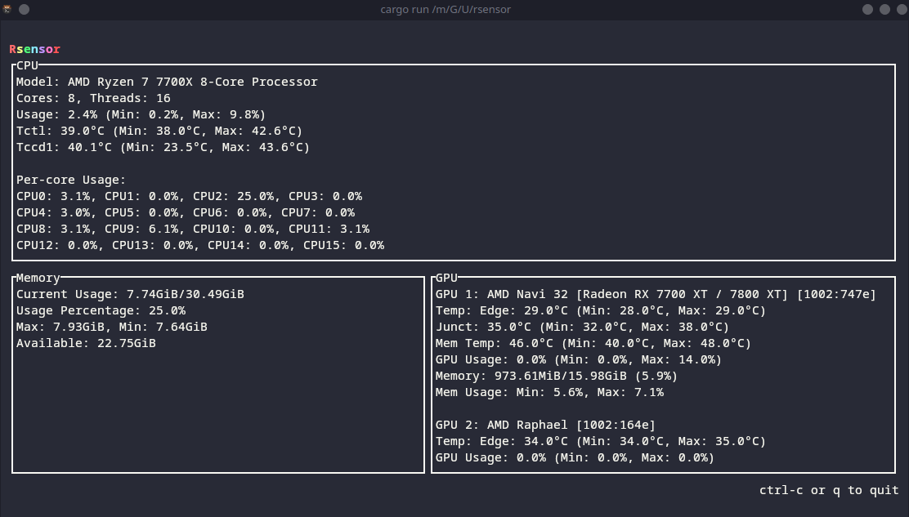

I'll modify the README.md markdown directly:

# rsensor

A lightweight system monitoring tool written in Rust, inspired by psensor.


## Features

- Real-time CPU monitoring (usage, temperature, per-core stats)
- Memory usage statistics with min/max tracking
- GPU monitoring for both NVIDIA and AMD GPUs
- Terminal-based user interface with clean, responsive layout
- Low system resource usage

## Installation

### Arch Linux

You can install rsensor using the provided PKGBUILD:

```bash
# Clone the repository
git clone https://github.com/tahuffman1s/rsensor.git
cd rsensor

# Build and install the package
makepkg -si
```

### Flatpak

You can build and install rsensor as a Flatpak:

```bash
# Prerequisites: Install flatpak and flatpak-builder
# On Debian/Ubuntu:
# sudo apt install flatpak flatpak-builder
# On Fedora:
# sudo dnf install flatpak flatpak-builder
# On Arch:
# sudo pacman -S flatpak flatpak-builder

# Clone the repository
git clone https://github.com/tahuffman1s/rsensor.git
cd rsensor

# Install the Freedesktop Platform runtime if you don't have it
flatpak install org.freedesktop.Platform//23.08 org.freedesktop.Sdk//23.08

# Build the Flatpak
flatpak-builder --force-clean build-dir org.tahuffman1s.rsensor.yml

# Test the build (optional)
flatpak-builder --run build-dir org.tahuffman1s.rsensor.yml rsensor

# Create a local repository and install
flatpak-builder --repo=repo --force-clean build-dir org.tahuffman1s.rsensor.yml
flatpak --user remote-add --no-gpg-verify rsensor-repo repo
flatpak --user install rsensor-repo org.tahuffman1s.rsensor

# Run the application
flatpak run org.tahuffman1s.rsensor
```

### Manual Build

To build from source manually:

```bash
# Clone the repository
git clone https://github.com/tahuffman1s/rsensor.git
cd rsensor

# Build with cargo
cargo build --release

# The binary will be in target/release/rsensor
./target/release/rsensor
```

## Usage

Run `rsensor` from your terminal to start the application.

- Press `q` or `Ctrl+C` to exit
- The interface will automatically update every 250ms

If you're using the flatpak release it will add an icon to your menu.

It can also be ran using `flatpak run org.tahuffman1s.rsensor`

## License

This project is licensed under the MIT License - see the LICENSE.md file for details.
